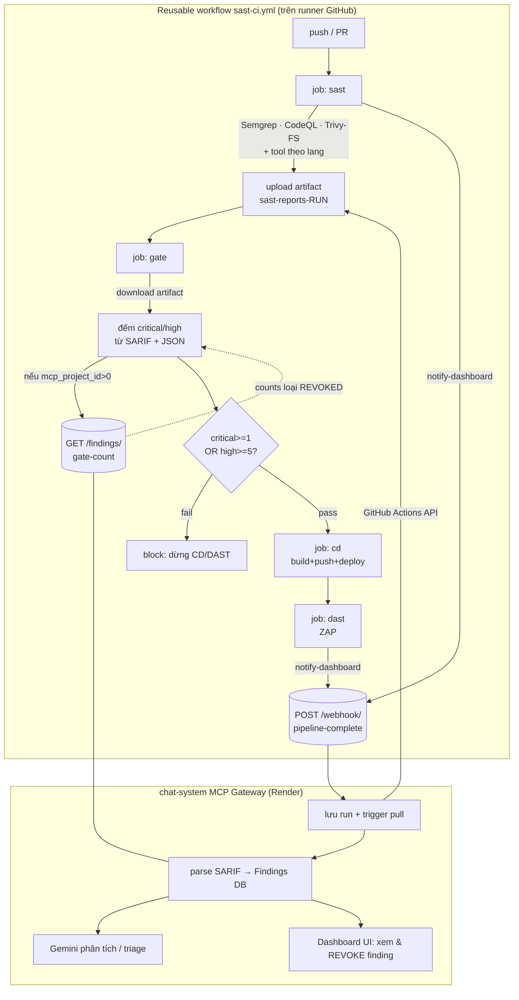

# sast-action — Flow & tích hợp với chat-system

> Tài liệu kiến trúc cho thư viện GitHub Actions `cochecheee/sast-action` và cách
> nó nối với dashboard DevSecOps `cochecheee/ChatSystem`. Viết cho đồ án tốt
> nghiệp (báo cáo docx ch.4.2). Cập nhật: 2026-06-05.

---

## 1. sast-action là gì

Một **thư viện GitHub Actions tái sử dụng**. Repo kế thừa (vd `SAST_CICD` /
ALOUTE) chỉ cần một block caller mỏng:

```yaml
jobs:
  security:
    uses: cochecheee/sast-action/.github/workflows/sast-ci.yml@master
    with:
      language: java
    secrets:
      dashboard_url:   ${{ secrets.MCP_GATEWAY_URL }}
      dashboard_token: ${{ secrets.MCP_WEBHOOK_TOKEN }}
      nvd_api_key:     ${{ secrets.NVD_API_KEY }}
```

→ tự động chạy SAST/SCA theo ngôn ngữ, chặn pipeline qua security gate, và báo
kết quả về chat-system.

### Thành phần

| File | Loại | Vai trò |
|---|---|---|
| `.github/workflows/sast-ci.yml` | reusable workflow | Bộ điều phối — wire các composite thành stage `sast → gate → cd → dast` |
| `actions/sast-suite` | composite | Chạy tool SAST/SCA theo `language`, upload artifact `sast-reports-<run>` |
| `actions/security-gate` | composite | Đếm critical/high từ report, fail nếu vượt ngưỡng; hỏi MCP `/findings/gate-count` |
| `actions/notify-dashboard` | composite | POST metadata run về `/webhook/pipeline-complete` |
| `actions/aggregate-sarif` | composite | POST từng report về `/artifacts/process` (đường push thay cho poller) |
| `actions/build-image` | composite | Docker build + push |
| `actions/deploy-staging` | composite | Trigger Render deploy hook |
| `actions/run-dast` | composite | OWASP ZAP baseline/full scan |
| `action.yml` (root) | action lẻ | Legacy v0.1.0 — chỉ notify |

### Tool theo ngôn ngữ

| Lang | Universal | Riêng |
|---|---|---|
| java | Semgrep, CodeQL, Trivy-FS | SpotBugs, OWASP Dep-Check |
| python | Semgrep, CodeQL, Trivy-FS | Bandit, Safety |
| node | Semgrep, CodeQL, Trivy-FS | ESLint-security, npm-audit |
| go | Semgrep, CodeQL, Trivy-FS | gosec |

---

## 2. Flow chi tiết



### Thứ tự stage trong `sast-ci.yml`

1. **`sast`** — chạy `sast-suite`, upload `sast-reports-<run_number>`, gọi
   `notify-dashboard` (nếu có `dashboard_url`).
2. **`gate`** (`needs: sast`, bật mặc định) — chạy `security-gate`. Tải artifact,
   đếm, verdict. Fail → các job sau bị chặn.
3. **`cd`** (`needs: [sast, gate]`, chỉ khi `deploy: true`) — build image, deploy
   Render. Chạy khi gate `success` hoặc `skipped`.
4. **`dast`** (`needs: cd`, chỉ khi `dast: true`) — ZAP scan staging URL.

### Cách security-gate đếm (file `actions/security-gate/action.yml`)

- `*.sarif`: `level=="error"` → high baseline; `security-severity >= 9.0` →
  critical, `[7.0, 9.0)` → high; tag `severity:critical|high` (Trivy).
- `trivy-*.json`: `.Results[].Vulnerabilities[].Severity`.
- `safety.json`: mỗi entry = 1 high.
- `depcheck.json`: `.severity` CRITICAL/HIGH.
- `npm-audit.json`: `.metadata.vulnerabilities.{critical,high}`.
- **Verdict**: `fail` nếu `critical >= fail_on_critical` (mặc định 1) hoặc
  `high >= fail_on_high` (mặc định 5).
- **V3.1 learning loop**: nếu truyền `mcp_gateway_url` + `mcp_project_id`, gate
  GET `/findings/gate-count?project_id=&run_id=` và **ưu tiên** counts đó (đã loại
  finding REVOKED) → dev triage false-positive trên dashboard thì lần chạy sau
  pass mà không sửa code.

---

## 3. Ba điểm tích hợp với chat-system

| # | Hướng | Action | HTTP | Payload |
|---|---|---|---|---|
| 1 | CI → MCP | notify-dashboard | `POST /webhook/pipeline-complete` | `{run_id, run_number, repository, ref, sha, actor, event, pipeline_status, timestamp}` + `Authorization: Bearer <token>` |
| 2 | MCP → CI | (poller MCP) | GitHub Actions API | kéo artifact `sast-reports-<run>` để parse |
| 2' | CI → MCP | aggregate-sarif (tùy chọn) | `POST /artifacts/process` | `{project_id, artifact_name, content}` + `X-API-Key` |
| 3 | CI → MCP | security-gate | `GET /findings/gate-count?project_id=&run_id=` | trả `{critical, high}` (loại REVOKED) |

Có **2 đường đưa SARIF vào MCP**: (a) poller MCP tự kéo artifact (mặc định, chỉ
cần webhook #1), hoặc (b) CI chủ động push từng file qua #2' (cho repo private/
artifact bị tắt). Khuyến nghị: dùng poller.

---

## 4. Trạng thái chat-system hiện tại (đã kiểm chứng trên branch `ft/imp-fe`)

> ⚠️ Branch `master` chỉ là **skeleton 29 dòng** (`/` + `/health`) — KHÔNG phản
> ánh hiện trạng. Bản triển khai thật nằm ở branch **`ft/imp-fe`**. Đừng đánh giá
> hệ thống qua `master`.

MCP Gateway đã được triển khai gần đầy đủ (FastAPI + SQLAlchemy/aiosqlite +
Gemini). Những gì sast-action cần **đều đã có sẵn**:

| Thành phần | Vị trí (`ft/imp-fe`) | Trạng thái |
|---|---|---|
| `POST /webhook/pipeline-complete` (202) | `mcp/src/api/artifacts.py` | ✅ có |
| `POST /artifacts/process` | `mcp/src/api/artifacts.py` | ✅ có |
| `GET /findings/gate-count` | `mcp/src/api/findings.py` | ✅ có |
| Poller nền | `mcp/src/services/poller.py` | ✅ có — **multi-tenant** |
| Lọc artifact theo profile | `mcp/src/services/processor.py` + `config/profiles/github-actions-default.yml` | ✅ profile đã match `sast-reports-*` |
| DB `Project` + `Finding(status)` | `mcp/src/models/entities.py` | ✅ có (status hỗ trợ triage/REVOKED) |
| Đa project | `Project.polling_workflow_name`, `GitHubClient.for_project()` | ✅ credentials/config theo từng project |

→ Đa số "khoảng trống" ở các bản nháp trước (dựa trên `master`) thực ra **đã được
lấp**. Phần thật sự còn lại xem §5.

---

## 5. Trạng thái cải tiến & việc còn lại

### 5.1 ✅ Name-agnostic poller — ĐÃ LÀM (PR `fix/poller-name-agnostic`)

**Vấn đề trước đây**: poller lọc run theo **tên workflow chính xác**
(`github_client.list_workflow_runs` filter `r["name"] == workflow_name`), default
cứng `"CI Workflow"`. Repo đặt tên khác (hoặc quên set per-project) → **miss run**.
Ép mọi repo đổi tên giống nhau là anti-pattern, phá điểm mạnh "drop 1 block là chạy".

**Hợp đồng thật của sast-action không phải tên workflow mà là tên artifact**:
`sast-suite` luôn upload `sast-reports-<run_number>`, và profile
`github-actions-default.yml` đã match prefix đó.

**Đã sửa**: `POLLING_WORKFLOW_NAME` và `Project.polling_workflow_name` default về
`""` (= match mọi run). Bộ lọc thật là **artifact profile** trong
`processor.process_run`. Mỗi repo đặt tên workflow tùy ý mà poller không miss; vẫn
có thể set tên (global hoặc per-project) để thu hẹp polling khi cần tiết kiệm API.
Kèm test khóa hợp đồng "tên rỗng = trả mọi run".

Hai lớp matching thực tế trong code (đã có sẵn, nay name-agnostic):
1. **Webhook** `/webhook/pipeline-complete` gửi `run_id` → MCP pull thẳng run đó,
   không cần tên workflow.
2. **Poller** list mọi completed run → `processor.process_run` lọc artifact theo
   profile → chỉ artifact `sast-reports-*` (hoặc report khác trong profile) sinh
   findings.

> **Migrate**: default mới chỉ áp project **tạo mới**. Project đã có trong DB vẫn
> giữ `"CI Workflow"` — set `polling_workflow_name=""` qua UI/API để name-agnostic.
> Không cần DB migration (default Python-side, không đổi schema).

### 5.2 ✅ Ba endpoint — ĐÃ CÓ trên `ft/imp-fe`
- `POST /webhook/pipeline-complete` → 202 (`artifacts.py`)
- `POST /artifacts/process` (`artifacts.py`)
- `GET /findings/gate-count?project_id=&run_id=` → `{critical, high}` loại REVOKED
  (`findings.py`). Gate tự fallback raw counts nếu endpoint lỗi/timeout.

### 5.3 ✅ DB learning loop — ĐÃ CÓ
`Project` + `Finding(status)` đã tồn tại; `gate-count` đếm loại finding đã triage.
Dashboard đã có thao tác flag/triage finding → đúng vòng học V3.1.

### 5.4 ⚠️ Còn nên rà — severity mapping nhất quán
security-gate (bash) map `security-severity` numeric (≥9.0 crit / 7.0–9.0 high) +
`level==error`. Cần đảm bảo normalizer của MCP cho ra critical/high **khớp** raw
counts để `gate-count` không lệch (tránh "raw fail nhưng mcp pass"). Đối chiếu với
`tests/test_normalizer_severity_v38.py`.

### 5.5 ⚠️ Còn nên rà — auth token 2 phía
- webhook: `Authorization: Bearer` ↔ `CI_WEBHOOK_TOKEN`
- artifacts/process: `X-API-Key` ↔ `CI_API_KEY`
- gate-count: xác nhận policy auth (GET có cần token không) khớp cả CI lẫn MCP.

### 5.6 ⬜ Wiring `project_id` từ CI — việc của người dùng
Caller ALOUTE set `mcp_project_id: <Project.id>` (hiện 0 = tắt) để bật learning
loop. `Project.id` lấy từ DB sau khi tạo project trên dashboard.

---

## 6. Checklist tích hợp (ALOUTE ↔ chat-system)

- [x] Caller ALOUTE `ci.yml` gọi reusable `@master`, language=java
- [x] Artifact name `sast-reports-<run_number>` (sast-suite ↔ profile khớp)
- [x] 5 SAST tool chạy được (đã fix SpotBugs/commons-lang3, CodeQL v4)
- [x] MCP `/webhook/pipeline-complete` (202) — có trên `ft/imp-fe`
- [x] MCP poller multi-tenant + name-agnostic (PR `fix/poller-name-agnostic`)
- [x] MCP `/findings/gate-count` + DB `Project`/`Finding(status)` — có
- [x] Dashboard triage/flag finding — có
- [ ] Merge PR `fix/poller-name-agnostic`; set `polling_workflow_name=""` cho project cũ
- [ ] Set `mcp_project_id` ở caller để bật V3.1 loop
- [ ] Rà severity mapping & auth token 2 phía (§5.4–5.5)

---

## 7. Tham chiếu nhanh

- Reusable: `cochecheee/sast-action/.github/workflows/sast-ci.yml@master`
- Webhook contract: xem `README.md` mục "Webhook contract"
- MCP (bản thật): `cochecheee/ChatSystem` branch **`ft/imp-fe`** → `mcp/src/api/`,
  `mcp/src/services/poller.py`, `mcp/src/services/processor.py`
- Artifact profile: `mcp/config/profiles/github-actions-default.yml`
- ⚠️ `master` chỉ là skeleton 29 dòng — KHÔNG dùng để đánh giá hiện trạng.
