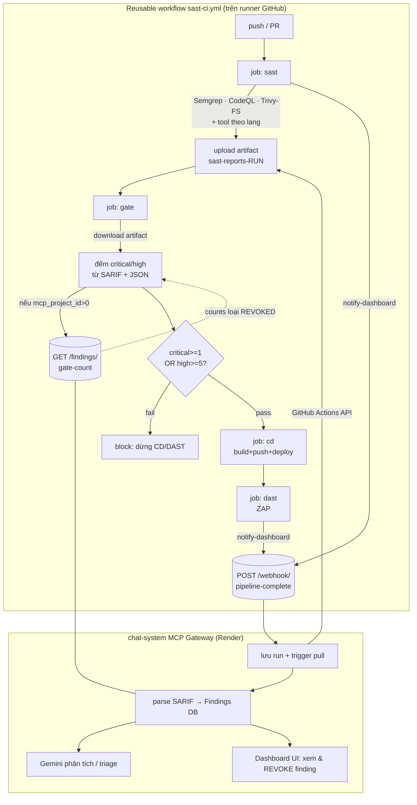

# sast-action — Flow & tích hợp với chat-system

> Tài liệu kiến trúc cho thư viện GitHub Actions `cochecheee/sast-action` và cách
> nó nối với dashboard DevSecOps `cochecheee/ChatSystem`. Viết cho đồ án tốt
> nghiệp (báo cáo docx ch.4.2). Cập nhật: 2026-06-05.

---

## 1. sast-action là gì

Một **thư viện GitHub Actions tái sử dụng**. Repo kế thừa (vd `SAST_CICD` /
ALOUTE) chỉ cần một block caller mỏng:

```yaml
jobs:
  security:
    uses: cochecheee/sast-action/.github/workflows/sast-ci.yml@master
    with:
      language: java
    secrets:
      dashboard_url:   ${{ secrets.MCP_GATEWAY_URL }}
      dashboard_token: ${{ secrets.MCP_WEBHOOK_TOKEN }}
      nvd_api_key:     ${{ secrets.NVD_API_KEY }}
```

→ tự động chạy SAST/SCA theo ngôn ngữ, chặn pipeline qua security gate, và báo
kết quả về chat-system.

### Thành phần

| File | Loại | Vai trò |
|---|---|---|
| `.github/workflows/sast-ci.yml` | reusable workflow | Bộ điều phối — wire các composite thành stage `sast → gate → cd → dast` |
| `actions/sast-suite` | composite | Chạy tool SAST/SCA theo `language`, upload artifact `sast-reports-<run>` |
| `actions/security-gate` | composite | Đếm critical/high từ report, fail nếu vượt ngưỡng; hỏi MCP `/findings/gate-count` |
| `actions/notify-dashboard` | composite | POST metadata run về `/webhook/pipeline-complete` |
| `actions/aggregate-sarif` | composite | POST từng report về `/artifacts/process` (đường push thay cho poller) |
| `actions/build-image` | composite | Docker build + push |
| `actions/deploy-staging` | composite | Trigger Render deploy hook |
| `actions/run-dast` | composite | OWASP ZAP baseline/full scan |
| `action.yml` (root) | action lẻ | Legacy v0.1.0 — chỉ notify |

### Tool theo ngôn ngữ

| Lang | Universal | Riêng |
|---|---|---|
| java | Semgrep, CodeQL, Trivy-FS | SpotBugs, OWASP Dep-Check |
| python | Semgrep, CodeQL, Trivy-FS | Bandit, Safety |
| node | Semgrep, CodeQL, Trivy-FS | ESLint-security, npm-audit |
| go | Semgrep, CodeQL, Trivy-FS | gosec |

---

## 2. Flow chi tiết



### Thứ tự stage trong `sast-ci.yml`

1. **`sast`** — chạy `sast-suite`, upload `sast-reports-<run_number>`, gọi
   `notify-dashboard` (nếu có `dashboard_url`).
2. **`gate`** (`needs: sast`, bật mặc định) — chạy `security-gate`. Tải artifact,
   đếm, verdict. Fail → các job sau bị chặn.
3. **`cd`** (`needs: [sast, gate]`, chỉ khi `deploy: true`) — build image, deploy
   Render. Chạy khi gate `success` hoặc `skipped`.
4. **`dast`** (`needs: cd`, chỉ khi `dast: true`) — ZAP scan staging URL.

### Cách security-gate đếm (file `actions/security-gate/action.yml`)

- `*.sarif`: `level=="error"` → high baseline; `security-severity >= 9.0` →
  critical, `[7.0, 9.0)` → high; tag `severity:critical|high` (Trivy).
- `trivy-*.json`: `.Results[].Vulnerabilities[].Severity`.
- `safety.json`: mỗi entry = 1 high.
- `depcheck.json`: `.severity` CRITICAL/HIGH.
- `npm-audit.json`: `.metadata.vulnerabilities.{critical,high}`.
- **Verdict**: `fail` nếu `critical >= fail_on_critical` (mặc định 1) hoặc
  `high >= fail_on_high` (mặc định 5).
- **V3.1 learning loop**: nếu truyền `mcp_gateway_url` + `mcp_project_id`, gate
  GET `/findings/gate-count?project_id=&run_id=` và **ưu tiên** counts đó (đã loại
  finding REVOKED) → dev triage false-positive trên dashboard thì lần chạy sau
  pass mà không sửa code.

---

## 3. Ba điểm tích hợp với chat-system

| # | Hướng | Action | HTTP | Payload |
|---|---|---|---|---|
| 1 | CI → MCP | notify-dashboard | `POST /webhook/pipeline-complete` | `{run_id, run_number, repository, ref, sha, actor, event, pipeline_status, timestamp}` + `Authorization: Bearer <token>` |
| 2 | MCP → CI | (poller MCP) | GitHub Actions API | kéo artifact `sast-reports-<run>` để parse |
| 2' | CI → MCP | aggregate-sarif (tùy chọn) | `POST /artifacts/process` | `{project_id, artifact_name, content}` + `X-API-Key` |
| 3 | CI → MCP | security-gate | `GET /findings/gate-count?project_id=&run_id=` | trả `{critical, high}` (loại REVOKED) |

Có **2 đường đưa SARIF vào MCP**: (a) poller MCP tự kéo artifact (mặc định, chỉ
cần webhook #1), hoặc (b) CI chủ động push từng file qua #2' (cho repo private/
artifact bị tắt). Khuyến nghị: dùng poller.

---

## 4. Trạng thái chat-system hiện tại (đã kiểm chứng trên `master`)

`mcp/src/main.py` mới là **skeleton 29 dòng** — chỉ có `/` và `/health`.
`requirements.txt` + `.env.example` cho thấy thiết kế dự kiến:

- FastAPI + SQLAlchemy + aiosqlite (DB `mcp.db`)
- SARIF: `sarif-pydantic`, `cwe2`, `cvss`, `detect-secrets`, `defusedxml`
- AI: `google-genai` (Gemini) — phân tích/triage finding
- Poller: `GITHUB_TOKEN` (actions:read, contents:read), `POLLING_INTERVAL_SECONDS=300`,
  `POLLING_WORKFLOW_NAME="Security Scans"`
- Auth JWT (`SECRET_KEY`), rate-limit (`slowapi`)

→ **3 endpoint mà sast-action gọi đều CHƯA được implement.** Đang nằm ở
`.planning/phases/02-mcp-gateway-server-development/`.

---

## 5. Khoảng trống tương thích & cách cải tiến

### 5.1 ❗ Tên workflow lệch — poller sẽ không thấy run
- **Vấn đề**: `.env.example` đặt `POLLING_WORKFLOW_NAME="Security Scans"`, nhưng
  workflow caller của ALOUTE tên **`CI Workflow`**. Poller lọc theo tên → bỏ sót
  toàn bộ run.
- **Fix (chọn 1)**:
  - Đổi `POLLING_WORKFLOW_NAME=CI Workflow` trong `.env` của MCP, **hoặc**
  - Đổi `name:` của caller workflow thành `Security Scans` (lưu ý: hiện đang giữ
    tên `CI Workflow` để `cd.yml` còn trigger được — nếu đổi phải sửa cả `cd.yml`).
- Khuyến nghị: đổi env phía MCP (ít rủi ro hơn).

### 5.2 Implement 3 endpoint (phase 02)
```
POST /webhook/pipeline-complete   # nhận metadata, đẩy vào hàng đợi pull artifact
POST /artifacts/process           # nhận {project_id, artifact_name, content SARIF}
GET  /findings/gate-count         # ?project_id=&run_id= → {critical, high} loại REVOKED
```
- `/webhook/pipeline-complete` trả **HTTP 202** (notify-dashboard coi 202 =
  accepted; khác 202 chỉ là warning, không fail CI).
- `/findings/gate-count` phải nhanh (gate có timeout 5 phút) và trả JSON đúng
  schema `{"critical": <int>, "high": <int>}`; nếu lỗi, gate tự fallback raw counts.

### 5.3 DB schema tối thiểu cho learning loop
```
Project(id, repo, ...)
Finding(id, project_id, run_id, rule_id, severity, status, ...)
  status ∈ {ACTIVE, REVOKED}   # REVOKED = dev xác nhận false-positive
```
- `gate-count` = `COUNT(*) WHERE project_id=? AND run_id=? AND status='ACTIVE'`
  group theo severity (critical/high).
- Dashboard cần nút REVOKE/un-REVOKE → đây chính là vòng học của V3.1.

### 5.4 Thống nhất severity mapping
- security-gate map theo `security-severity` numeric (9.0 crit / 7.0–9.0 high) và
  `level==error`. MCP khi parse SARIF nên **dùng cùng quy tắc** (qua `cvss`/`cwe2`)
  để counts của `gate-count` khớp raw counts của gate → tránh "raw fail nhưng mcp
  pass" do lệch cách quy đổi.

### 5.5 Auth nhất quán
- notify-dashboard gửi `Authorization: Bearer <dashboard_token>` → MCP so với
  `CI_WEBHOOK_TOKEN`.
- aggregate-sarif gửi `X-API-Key` → MCP so với `CI_API_KEY`.
- gate-count hiện **không gắn token** → nên cho phép GET không auth hoặc thêm
  header tương ứng ở cả 2 phía.

### 5.6 Wiring `project_id` từ CI
- Để bật learning loop, caller ALOUTE phải set `mcp_project_id: <Project.id>`
  (hiện để 0 = tắt). `Project.id` lấy từ DB chat-system sau khi tạo project.

---

## 6. Checklist tích hợp (ALOUTE ↔ chat-system)

- [x] Caller ALOUTE `ci.yml` gọi reusable `@master`, language=java
- [x] Artifact name `sast-reports-<run_number>` (sast-suite ↔ poller khớp)
- [x] 5 SAST tool chạy được (đã fix SpotBugs/commons-lang3, CodeQL v4)
- [ ] MCP implement `/webhook/pipeline-complete` (202)
- [ ] MCP implement poller (sửa `POLLING_WORKFLOW_NAME`)
- [ ] MCP implement `/findings/gate-count` + DB Project/Finding(status)
- [ ] Dashboard có nút REVOKE finding
- [ ] Set `mcp_project_id` ở caller để bật V3.1 loop
- [ ] Thống nhất severity mapping & auth token 2 phía

---

## 7. Tham chiếu nhanh

- Reusable: `cochecheee/sast-action/.github/workflows/sast-ci.yml@master`
- Webhook contract: xem `README.md` mục "Webhook contract"
- MCP skeleton: `cochecheee/ChatSystem` → `mcp/src/main.py`
- Phase MCP: `cochecheee/ChatSystem` → `.planning/phases/02-mcp-gateway-server-development/`
